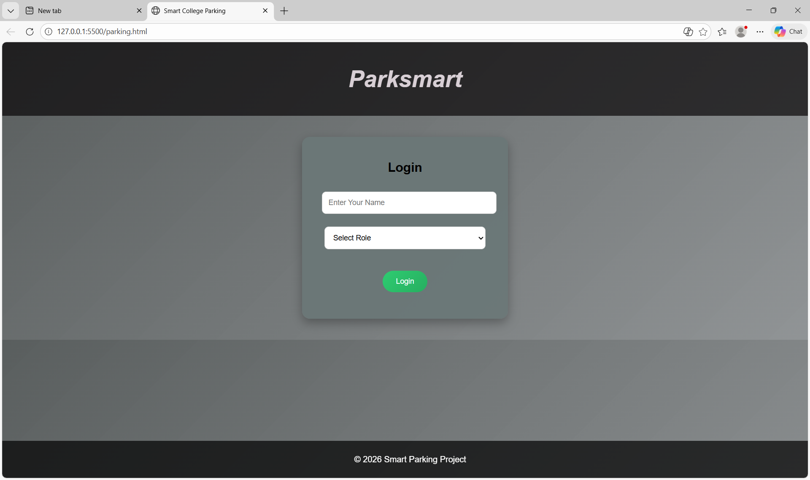
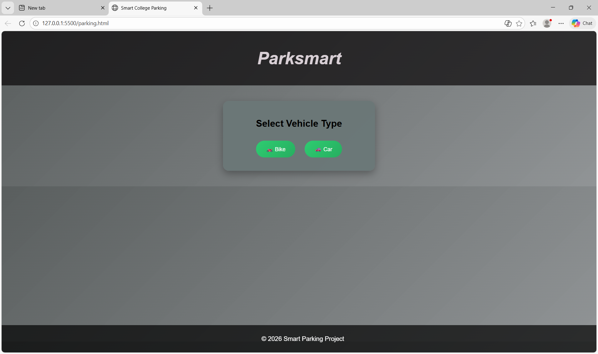
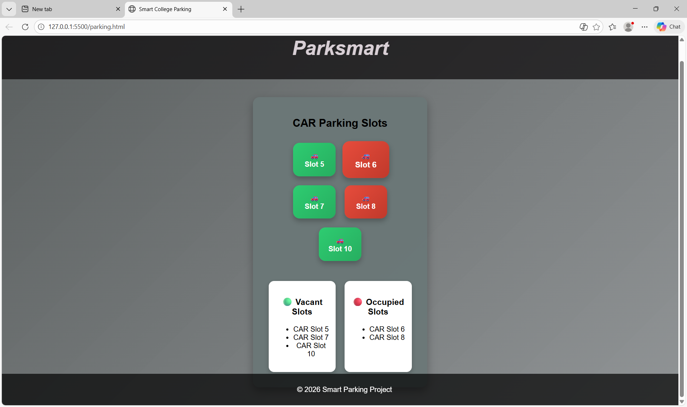

# Smart College Parking System 🎯

### Team Name: codestorm

### Team Members

* Member 1: fathima rinu
* Member 2: ayisha minnath

### Hosted Project Link

🔗 https://fathimarinu602-ctrl.github.io/parksmart/

### Project Description

Smart College Parking System is a web-based application that helps students and teachers view vacant and occupied parking slots for bikes and cars. Users can log in, select vehicle type, book or cancel slots, and receive confirmation of successful booking.

---

### The Problem Statement

In colleges, finding an available parking slot is difficult due to poor parking management and lack of real-time information. This leads to congestion, time wastage, and confusion.

---

### The Solution

This project provides a digital platform where users can check parking slot availability instantly. It allows slot selection, cancellation, and confirmation through a simple and user-friendly interface.

---

## Technical Details

### Technologies/Components Used

**For Software:**

* Languages used: HTML, CSS, JavaScript
* Frameworks used: None (Vanilla JS)
* Libraries used: None
* Tools used: VS Code, GitHub, Web Browser

**For Hardware:**

* Main components: Not applicable (Software-based project)
* Specifications: N/A
* Tools required: Computer with browser

---

## Features

* Feature 1: User login using Name and Role (Student/Teacher)
* Feature 2: Vehicle selection (Bike / Car)
* Feature 3: Display of vacant and occupied parking slots
* Feature 4: Slot selection and cancellation
* Feature 5: Slot confirmation success page

---

#### Screenshots 

*Login page where user enters name and role.*

*select vehicle type.*

*showing vaccant slots.*

---

### Video

🎥 **[[Add your demo video link here](https://drive.google.com/file/d/1s8mgIHoyEjBeUCPCn0Zd-YOgJWFImXva/view?usp=sharing)]**

---

